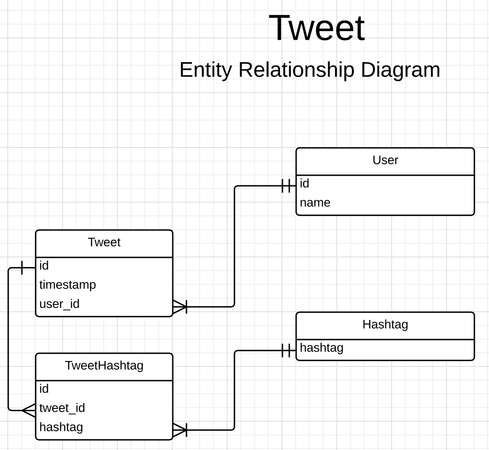

## Assignment 3


### Assignment Questions
We need to answer the following questions by "querying" tweet data that was acquired from a conference in Prague:

 1. Who tweeted the most during the conference?
 2. What were the top 10 hash tags used?
 3. For a particular hour, how many tweets were produced?

### Task 1
**Draw a UML ER diagram how you would model your information extracted from the raw tweet data.**

If all we need to do is to answer the three questions above, we can discard most of the data in the raw tweet, since all
we need are user details, the timestamp of the tweet, and any hashtags in the tweet.  To store this in a relational model,
we could follow the following structure:



User and Hashtag tables here are optional - it would be possible to conduct the analysis using only the Tweet and
TweetHashtag tables, however within a relational model, all four tables are required to have a Third Form Normal schema.
In particular, since more than one tweeter at the conference might have the same name, it is prudent to rely on user_id as
the unique identifier for users - which means that in order to keep data  3FN, we require the separate Users table with
one-to-many relationship to store information about the user's name.


### Task 2
#### Key/Value
##### Implementation Model/Schema

In either a Key/Value Object Store or a NoSQL context, this data could simple be stored as a JSON blob, using the
following structure:

```python

    tweet = {'tweet_id': 'id',
             'user_id': 'user_id',
             'user_name': 'user_name',
             'hashtags':['hashtag1','hashtag2','hashtag3','etc...'],
             'created_at': 'timestamp'}

```
Because we can include an array of multiple hashtags within our tweet object, in doing this we no longer have to handle
the one-to-many relationship between tweets and hashtags that the relational structure detailed in the ER diagram above
forced upon us, since this can be included implicitly within the JSON object.

If we only intended to run MR jobs against the data stored in the key-value object store, we might instead chose to store
all the data in a single text file, with each line representing a single tweet. Storing the data as a series of JSON objects,
however, gives us more options regarding the form of analysis we can undertake.

##### Extracting/Storing the data
We can extract the relevant information to put into the above schema from the tweet object as follows (storing each tweet
as a separate JSON object, using its tweet id as its key):

```python

    import json
    import time
    import boto
    from boto.s3.key import Key
    
    
    def store_tweet_data(files, k):
        for f in files:
            with open(f, 'r') as json_file:
                raw_tweets = json.load(json_file)
        for raw_tweet in raw_tweets:
            ts = time.strftime('%Y-%m-%d %H:%M:%S', time.strptime(raw_tweet['created_at'],'%a %b %d %H:%M:%S +0000 %Y'))
            tweet = {'tweet_id': raw_tweet['id'],
                     'user_id': raw_tweet['user']['id'],
                     'user_name': raw_tweet['user']['name'],
                     'hashtags':[hashtag['text'] for hashtag in raw_tweet['entities']['hashtags']],
                     'created_at': ts}
            k.key = 'twitter-assignment/' + raw_tweet['id'] + '.json'
            k.set_contents_from_string(tweet)
    
    files = ['prague-2015-02-14.json', 'prague-2015-02-15.json']
    conn = boto.connect_s3()
    bucket = conn.create_bucket('janakmayer.berkeley.storingretrieving')
    k = Key(bucket)
    store_tweet_data(files, k)

```

##### Answering the questions
To answer the questions using pure key-value object storage, we would need to iterate through each tweet object, emitting
counts of the relevant attributes. On a small dataset like this, this could be done through simple iteration, while on a 
larger data set it would make more sense to use a MapReduce implementation.

1. Who tweeted the most during the conference?
    * To implement this using an MR implementation, we might define a mapper function, a combiner function, and a reducer
    function.  The mapper function would iterate through each of the json files in the directory, opening each (using json.loads)
    and emitting a tuple for each tweet, containing the user_id or user_name of the tweet
    user, along with the value '1'. The combiner would then aggregate these count for each key (ie user_id or user_name),
    giving us just one tuple for each key, along with the count for that key.
        
    ```python
    
        class CountTweets(MRJob):
    
        def mapper(self, _, line):
            # json.loads stuff here - ommited since not a full implementation
            yield tweet['user_name'], 1
    
        def combiner(self, word, counts):
            yield word, sum(counts)
        
    ```
    
    Finally the reducer could then perform a sort and report the maximum value.

    

1. What were the top 10 hash tags used?
    * This would also make sense to implement using MR. The same process would be used, except the mapper would need to iterate
     through each hashtag (remembering that there are multiple hashtags per tweet), emmiting key-value tuples where the 
     hashtag is the tuple, and '1' the value. The combiner would perform the same summing function as above, and the 
     reducer would similarly perform a sort, and return the top 10 entries from the sorted list.
     
1. For a particular hour, how many tweets were produced?
    * This could be implemented through MR following the same pattern as above, but with the variation that the mapper would
    emit a 1 or a 0 depending on whether or not the tweet was in the selected time frame:

    ```python
    
        class CountTweets(MRJob):
    
        def mapper(self, _, line):
            # json.loads stuff here - ommited since not a full implementation
            yield tweet['time_stamp'], (tweet['time_stamp']>='2015-02-14 10:00' * tweet['time_stamp']<'2015-02-14 17:00')
    
        def combiner(self, word, counts):
            yield word, sum(counts)
        
    ```


#### NoSQL
##### Implementation Model/Schema
The same implementation model / schema shown above for a key-value object store can be used to store the tweet data
in MongoDB.

##### Extracting/Storing the data
A version of the same process for extracting/storing the data as used above with Amazon S3 is shown for MongoDB:

```python

    import json
    import pymongo
    import time
    
    
    def store_tweet_data(files, db):
        for f in files:
            with open(f, 'r') as json_file:
                raw_tweets = json.load(json_file)
            for raw_tweet in raw_tweets:
                ts = time.strftime('%Y-%m-%d %H:%M:%S', time.strptime(raw_tweet['created_at'],'%a %b %d %H:%M:%S +0000 %Y'))
                tweet = {'tweet_id': raw_tweet['id'],
                         'user_id': raw_tweet['user']['id'],
                         'user_name': raw_tweet['user']['name'],
                         'hashtags':[hashtag['text'] for hashtag in raw_tweet['entities']['hashtags']],
                         'created_at': ts}
                db.insert(tweet)
    
    if __name__ == '__main__':
        files = ['prague-2015-02-14.json', 'prague-2015-02-15.json']
        conn = pymongo.MongoClient()
        db = conn.project.tweets
        store_tweet_data(files, db)

```

##### Answering the questions
To answer the questions, we could then use MongoDB's query language, eliminating the need to write an MR job - although
much of the way this is implented using Mongo queries is actually very similar to MR

1. Who tweeted the most during the conference?
    * To implement this using a Mongo query we can use MongoDB's agregation pipeline $group operator. This essentially
    returns a series of key,value tuples of users and numbers of tweets, much like the output of the mapper and combiner
    above. We then need to sort this to get the highest tweeting user at the conference:
        
    ```python
    
        import pymongo
        import operator
        
        db = pymongo.MongoClient().project
        
        # We use user_id rather than user_name in case there are users with the same name. We perform Mongo's
        # Equivalent of a SQL 'GROUP BY' query
        results = db.tweets.aggregate(
            {"$group":{"_id":"$user_id", "sum":{"$sum":1}}}
        )
        
        # Now we sort the tuples we get back from the agregation pipeline
        result_tuples = sorted([(result[u'_id'], result[u'sum']) for result in results[u'result']],
                               key=operator.itemgetter(1), reverse=True)
        max_tweeter_id = result_tuples[0][0]
        
        # Finally we retreive the name corresponding to the user id
        max_tweeter = db.tweets.find_one({"user_id": max_tweeter_id})['user_name']
        
        print '%s tweeted the most during the conference' % max_tweeter
        
        # result: XMLPrague tweeted the most during the conference

        
    ```
    

1. What were the top 10 hash tags used?
    * To implement this using a Mongo query we can use MongoDB's basic search functionality, including the $gte and $lt
    greater-than-or-equal-to and less-than operators
    
    ```python
    
        # We perform Mongo's Equivalent of a SQL 'GROUP BY' query, but first we have to 'unwind' the hashtag array to 
        # access the individual hashtag elements
        results = db.tweets.aggregate([
            {"$unwind": "$hashtags" },
            {"$group":{"_id":"$hashtags", "sum":{"$sum":1}}}
        ])
        
        # Now we sort the tuples we get back from the agregation pipeline
        result_tuples = sorted([(result[u'_id'], result[u'sum']) for result in results[u'result']],
                               key=operator.itemgetter(1), reverse=True)
        top_10_hashtags = [result[0] for result in result_tuples[:10]]
        print 'The top 10 hashtags were: %s' %top_10_hashtags
        
        # result: The top 10 hashtags were: [u'xmlprague', u'XMLPrague', u'thetransformationsong', u'oxygenxml', u'XProc', u'RDFa', u'BRILLIANT', u'XML', u'FUCKYEAH', u'xproc']

    ```
     
1. For a particular hour, how many tweets were produced?
    
    * To implement this using a Mongo query we can use MongoDB's basic search functionality, including the $gte and $lt
    greater-than-or-equal-to and less-than operators
    
    ```python
    
        hours = range(9, 16)
        days = ['2015-02-14', '2015-02-15']
        for day in days:
            for hour in hours:
                print '%s tweets at %s oclock on %s' %(
                    db.tweets.find({"created_at": {"$gte": str(day) + ' ' + str(hour+1) + ':00',
                                                   "$lt": str(day) + ' ' + str(hour+2) + ':00'}}).count(),
                    hour,
                    day)
    
        # hour+1 is adjustment for CET
        """
        result:
        19 tweets in 9 oclock hour on 2015-02-14
        42 tweets in 10 oclock hour on 2015-02-14
        9 tweets in 11 oclock hour on 2015-02-14
        24 tweets in 12 oclock hour on 2015-02-14
        24 tweets in 13 oclock hour on 2015-02-14
        29 tweets in 14 oclock hour on 2015-02-14
        64 tweets in 15 oclock hour on 2015-02-14
        16 tweets in 9 oclock hour on 2015-02-15
        66 tweets in 10 oclock hour on 2015-02-15
        13 tweets in 11 oclock hour on 2015-02-15
        13 tweets in 12 oclock hour on 2015-02-15
        41 tweets in 13 oclock hour on 2015-02-15
        44 tweets in 14 oclock hour on 2015-02-15
        49 tweets in 15 oclock hour on 2015-02-15
        """
    ```


#### Relational
##### Implementation Model/Schema
To store the data in a relational database, we can use the schema provided in the ER diagram above.
To create this schema using SQLAlchemy, we could do the following:
 
```python
 
    from sqlalchemy import Column, ForeignKey, Integer, String
    from sqlalchemy.ext.declarative import declarative_base
    from sqlalchemy.orm import relationship
    from sqlalchemy import create_engine
    
    Base = declarative_base()
    
    
    class User(Base):
        __tablename__ = 'user'
        # Here we define columns for the table user
        id = Column(Integer, primary_key=True)
        name = Column(String(250), nullable=False)
    
    
    class Hashtag:
        # Here we define columns for the table hashtag
        __tablename__ = 'hashtag'
        hashtag = Column(String(250), primary_key=True)
    
    
    class Tweet(Base):
        __tablename__ = 'tweet'
        # Here we define columns for the table address.
        id = Column(Integer, primary_key=True)
        time_stamp = Column(String(250))
        user_id = Column(Integer, ForeignKey('user.id'))
        user = relationship(User)
    
    
    class TweetHashtag:
        # Here we define columns for the table tweet_hashtag
        __tablename__ = 'tweet_hashtag'
        id = Column(Integer, primary_key=True)
        tweet_id = Column(Integer, ForeignKey('tweet.id'))
        tweet = relationship(Tweet)
        hashtag = Column(Integer, ForeignKey('hashtag.hashtag'))
        ht = relationship(Hashtag)
    
    
    
    
    # Create an engine
    engine = create_engine('sqlite:///:memory:')
    
    # Create all tables in the engine. This is equivalent to "Create Table"
    # statements in raw SQL.
    Base.metadata.create_all(engine)

```
##### Extracting/Storing the data
We could then use the SQLAlchemy ORM to add tweets to the SQLite database, treating them as plain Python Objects.
Since this is not a full implementation, full details are not included here, but an example using the 'Tweet' table is:

```python

    s = session()
    tweet = Tweet(id=raw_tweet['id'], time_stamp=ts, 'user_id'=raw_tweet['user']['id'])
    s.add(tweet)
    s.commit()

```


##### Answering the questions

1. Who tweeted the most during the conference?

    ```python
        
        s.query(Tweet).group_by(Tweet.user_id).count().label('total')).order_by('total).first()
        # A full implementation would also include a join to return user_name from the User table
    
    ```

1. What were the top 10 hash tags used?
    ```python
    
        s.query(TweetHashtag).group_by(TweetHashtag.hashtag).count().label('total')).order_by('total).limit(10)
    
    ```
1. For a particular hour, how many tweets were produced?
    ```python
    
        s.query(Tweet).filter(Tweet.time_stamp >='2015-02-14 10:00').filter(Tweet.time_stamp <'2015-02-14 11:00').count()
        
    ```
    
### Task 3
Full NoSQL implementation code is included above (in the NoSQL section), but can also be found in data_extract.py and
mongo_analysis.py

### Task 4
Answers to questions are included in code sections above (NoSQL section), but to recap:


* XMLPrague tweeted the most during the conference

* The top 10 hashtags were: [u'xmlprague', u'XMLPrague', u'thetransformationsong', u'oxygenxml', u'XProc', u'RDFa', u'BRILLIANT', u'XML', u'FUCKYEAH', u'xproc']


* 19 tweets in 9 oclock hour on 2015-02-14
* 42 tweets in 10 oclock hour on 2015-02-14
* 9 tweets in 11 oclock hour on 2015-02-14
* 24 tweets in 12 oclock hour on 2015-02-14
* 24 tweets in 13 oclock hour on 2015-02-14
* 29 tweets in 14 oclock hour on 2015-02-14
* 64 tweets in 15 oclock hour on 2015-02-14
* 16 tweets in 9 oclock hour on 2015-02-15
* 66 tweets in 10 oclock hour on 2015-02-15
* 13 tweets in 11 oclock hour on 2015-02-15
* 13 tweets in 12 oclock hour on 2015-02-15
* 41 tweets in 13 oclock hour on 2015-02-15
* 44 tweets in 14 oclock hour on 2015-02-15
* 49 tweets in 15 oclock hour on 2015-02-15